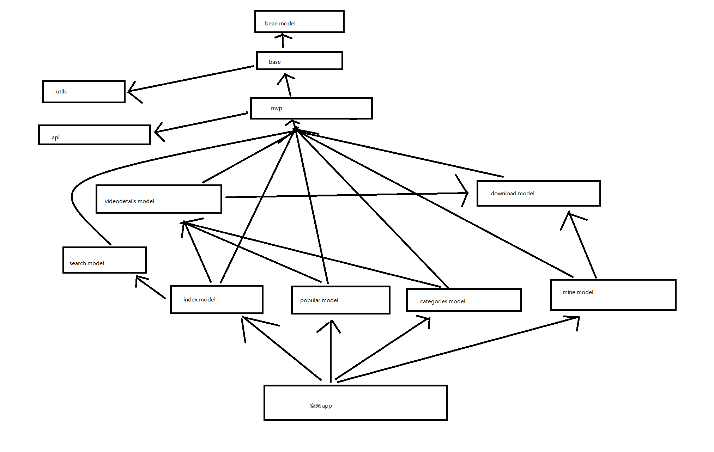

# VideoKotlin

#### 项目介绍
使用mvp+retrofit+rxjava

#### 项目功能
视频观看,视频断点下载

#### 项目实现
##### 视频观看
    使用GSYVideoPlayer开源项目
##### 视频下载
    使用多线程,封装retrofit+rxjava+ThreadPoolExecutor+service,并且支持断点下载

[蒲公英链接](https://www.pgyer.com/mGyP "蒲公英链接")

